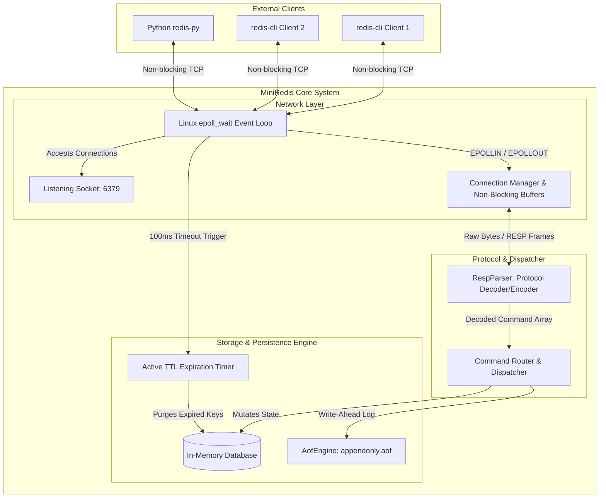
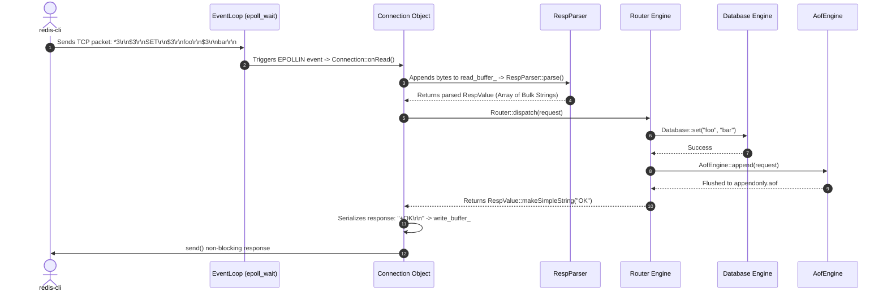
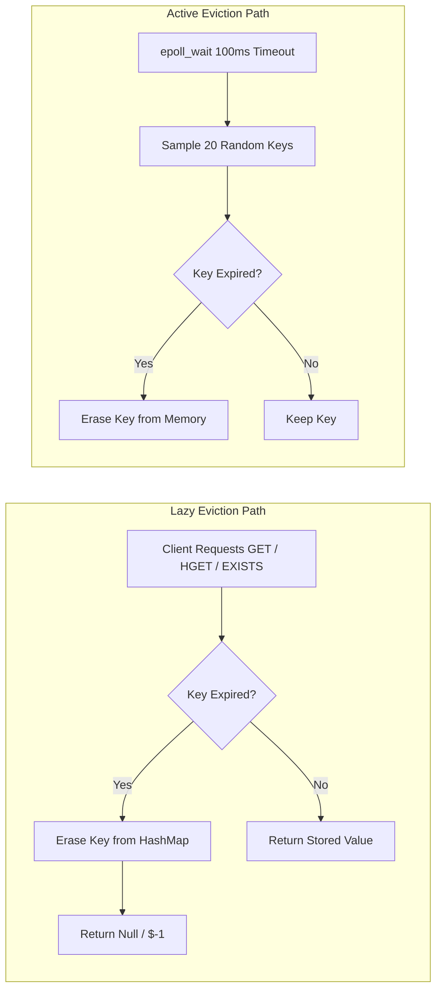

# 🏛️ MiniRedis: Architecture & Implementation Deep-Dive

Welcome to the comprehensive technical documentation for **MiniRedis**—a high-performance, single-threaded, event-driven in-memory Redis server clone built from scratch in C++17.

This document provides a detailed breakdown of the system architecture, file-by-file code explanations, implementation mechanics of core subsystems, and a technical comparison against official production Redis.

---

## 📌 Executive Summary & Architecture Philosophy

MiniRedis follows the exact same architectural philosophy as official Redis:
1. **Single-Threaded Event Reactor:** Utilizes an event-driven I/O loop (`epoll`) on Linux to handle thousands of concurrent client connections without mutex locks or thread context switching overhead.
2. **RESP Wire Protocol:** Speaks native RESP2 (Redis Serialization Protocol), enabling compatibility with official clients like `redis-cli`, Python `redis-py`, and Node `ioredis`.
3. **In-Memory Storage Engine:** Stores data in-memory for microsecond read/write operations using `std::unordered_map` and `std::variant`.
4. **Dual TTL Eviction Strategy:** Combines on-access **Lazy Eviction** with background **Active Random Sampling** (every 100ms) to purge expired keys.
5. **Write-Ahead Persistence (AOF):** Logs mutating state commands to disk (`appendonly.aof`) and replays them upon server reboot to guarantee data durability.

---

## 🔬 Deep Comparison: MiniRedis vs. Official Production Redis

> [!NOTE]
> Below is a comparison detailing how MiniRedis aligns with and differs from the official C implementation of Redis.

| Feature / Subsystem | Official Production Redis (C) | MiniRedis Implementation (C++17) | Comparative Analysis |
|---|---|---|---|
| **Networking & Concurrency** | Single-threaded event loop (`ae.c` wrapping `epoll`/`kqueue`/`select`) | Single-threaded `epoll_wait` Reactor (`EventLoop.cpp`) | 🎯 **95% Identical** — Both avoid thread lock contention by executing all state mutations on a single event loop. |
| **Protocol Parsing** | Native C buffer parsing (`hiredis`/`sds`) for RESP2 and RESP3 | `RespParser.cpp` parsing RESP2 stream primitives (`+`, `-`, `:`, `$`, `*`) | 🎯 **90% Identical** — MiniRedis parses full arrays, bulk strings, integers, and nulls. |
| **I/O Buffering** | Dynamic SDS client buffers with `aeCreateFileEvent(..., AE_WRITABLE)` | `write_buffer_` string with `EPOLLOUT` interest management | 🎯 **90% Identical** — Both register write interest only when socket buffers are full. |
| **Data Types Supported** | Strings, Hashes, Lists, Sets, Sorted Sets (SkipLists), HyperLogLog, Streams | Strings, Hashes (`unordered_map`), Lists (`deque`), Sets (`unordered_set`) | 🎯 **80% Identical** — Core 4 data types implemented using C++ STL containers. |
| **Key Eviction / Expiration** | Lazy eviction on access + Active random sampling (10Hz) | Lazy eviction on access + Active random sampling (100ms epoll timeout) | 🎯 **90% Identical** — Identical dual-mode expiration behavior. |
| **Persistence Engine** | RDB snapshots (`fork()`) + AOF append (`fsync`) + AOF rewrite | Write-Ahead Append-Only File (`appendonly.aof`) & startup replay | 🎯 **85% Identical** — MiniRedis logs mutating RESP commands to disk and replays on boot. |

---

## 📐 System Architecture & Diagrams

### 1. High-Level Event Reactor Architecture



---

### 2. Client Request Lifecycle Sequence Diagram



---

## 📂 File-by-File Technical Guide

Below is a detailed analysis of every file in the codebase, explaining its purpose, classes, methods, and low-level mechanisms.

```text
mini-redis/
├── CMakeLists.txt              # CMake build configuration
├── include/
│   ├── network/
│   │   ├── Socket.hpp          # POSIX Socket handle wrapper header
│   │   ├── Connection.hpp      # Per-client socket state & buffer header
│   │   └── EventLoop.hpp       # epoll reactor & event loop header
│   ├── protocol/
│   │   └── RespParser.hpp      # RESP protocol parser & encoder header
│   ├── storage/
│   │   ├── Value.hpp           # Data type variant & TTL struct header
│   │   ├── Database.hpp        # In-memory storage engine header
│   │   └── AofEngine.hpp       # AOF persistence log & recovery header
│   └── commands/
│       └── Router.hpp          # Command router dispatcher header
└── src/
    ├── network/
    │   ├── Socket.cpp          # POSIX socket system calls implementation
    │   ├── Connection.cpp      # Non-blocking I/O read/write handling
    │   └── EventLoop.cpp       # epoll_wait cycle & timer implementation
    ├── protocol/
    │   └── RespParser.cpp      # Stream parsing state machine implementation
    ├── storage/
    │   ├── Database.cpp        # Storage data structures & TTL purging
    │   └── AofEngine.cpp       # File I/O appending & replay implementation
    ├── commands/
    │   └── Router.cpp          # Redis command handlers & AOF hook logic
    └── main.cpp                # Application entry point & bootstrapping
```

---

### 1. Network Layer

#### 📄 `include/network/Socket.hpp` & `src/network/Socket.cpp`
* **Purpose:** Encapsulates raw Linux POSIX socket operations and manages file descriptor lifetimes.
* **Key Responsibilities:**
  * `listenOn(int port, int backlog)`: Performs `socket(AF_INET, SOCK_STREAM, 0)`, sets `SO_REUSEADDR`, calls `bind()` to `0.0.0.0:port`, and enters `listen()` state.
  * `setNonBlocking(bool non_blocking)`: Uses `fcntl(fd, F_GETFL, 0)` and `fcntl(fd, F_SETFL, flags | O_NONBLOCK)` to toggle non-blocking sockets.
  * `acceptConnection(string& client_ip, int& client_port)`: Invokes `accept()`, converts client binary address to IP string via `inet_ntop()`, and returns client file descriptor.
  * Move Semantics (`Socket(Socket&&)`): Prevents duplicate closing of file descriptors.

#### 📄 `include/network/Connection.hpp` & `src/network/Connection.cpp`
* **Purpose:** Manages per-client state, streaming read/write buffers, and non-blocking I/O operations.
* **Key Responsibilities:**
  * `onRead()`: Executes `recv()` on non-blocking client descriptor. Appends raw incoming bytes to `read_buffer_`. Iteratively calls `RespParser::parse()`, dispatches complete requests to `Router`, and appends responses to `write_buffer_`.
  * `onWrite()`: Flushes pending bytes in `write_buffer_` using `send(..., MSG_DONTWAIT)`. Erases successfully sent bytes from `write_buffer_`. Handles `EAGAIN`/`EWOULDBLOCK`.
  * `hasPendingWrites()`: Returns `true` if `write_buffer_` contains unsent response data.

#### 📄 `include/network/EventLoop.hpp` & `src/network/EventLoop.cpp`
* **Purpose:** The core **single-threaded epoll reactor loop**.
* **Key Responsibilities:**
  * `epoll_create1(0)`: Initializes Linux `epoll` kernel instance.
  * `addFd(int fd)` / `updateFdFlags(int fd, bool enable_write)`: Dynamically registers/modifies socket interest flags (`EPOLLIN` for reading, `EPOLLOUT` when write buffers are pending).
  * `run()`: Executes the main `epoll_wait(epoll_fd, events, MAX_EVENTS, 100)` loop:
    * Handles server listening socket events (accepts new clients).
    * Handles client socket `EPOLLIN` (reads incoming data) and `EPOLLOUT` (flushes pending writes).
    * **Active Expiration Hook:** Executes `db_.purgeExpiredKeys(20)` every 100ms timeout iteration.

---

### 2. Protocol Layer

#### 📄 `include/protocol/RespParser.hpp` & `src/protocol/RespParser.cpp`
* **Purpose:** Implements stateful stream parsing and serialization for the **Redis Serialization Protocol (RESP2)**.
* **Key Data Structures:**
  ```cpp
  enum class RespType { SimpleString, Error, Integer, BulkString, Array, Null };

  struct RespValue {
      RespType type;
      variant<string, int64_t, vector<RespValue>> value;
      string serialize() const; // Formats value back to standard RESP wire format
  };
  ```
* **Key Parsing Logic (`parse(string& input_buffer)`):**
  * Examines the prefix byte (`+`, `-`, `:`, `$`, `*`).
  * Finds line terminators (`\r\n`).
  * For Bulk Strings (`$`): Parses length, validates buffer has enough payload bytes (`len + 2`), and extracts string.
  * For Arrays (`*`): Recursively parses sub-elements.
  * **Consumes Buffer:** Only erases consumed bytes from `input_buffer` when a complete frame is parsed. If incomplete, returns `std::nullopt` and waits for more TCP data.

---

### 3. Storage Layer

#### 📄 `include/storage/Value.hpp`
* **Purpose:** Defines the polymorphic in-memory object stored for each key.
* **Key Structure:**
  ```cpp
  enum class ValueType { String, Hash, List, Set };

  using DataVariant = variant<string, unordered_map<string, string>, deque<string>, unordered_set<string>>;

  struct Value {
      ValueType type{ValueType::String};
      DataVariant data{string("")};
      optional<chrono::steady_clock::time_point> expire_at; // Absolute TTL deadline

      bool isExpired() const;
      int64_t getTtlSeconds() const;
  };
  ```

#### 📄 `include/storage/Database.hpp` & `src/storage/Database.cpp`
* **Purpose:** Primary key-value storage engine (`unordered_map<string, Value> store_`).
* **Key Operations:**
  * **Strings:** `set()`, `get()`, `incr()` (atomic integer increment/decrement).
  * **Hashes:** `hset()`, `hget()`, `hdel()`, `hgetall()`.
  * **Lists:** `lpush()`, `rpush()`, `lpop()`, `rpop()`, `lrange()`.
  * **Sets:** `sadd()`, `srem()`, `smembers()`.
  * **Key Utilities & Expiration:** `del()`, `exists()`, `expire()`, `ttl()`, `keys()`, `flush()`.
  * **Active Purging:** `purgeExpiredKeys(sample_limit)` randomly samples keys with TTL and deletes expired entries from memory.

#### 📄 `include/storage/AofEngine.hpp` & `src/storage/AofEngine.cpp`
* **Purpose:** Append-Only File (AOF) persistence logging & recovery manager.
* **Key Responsibilities:**
  * `append(const RespValue& command)`: Appends RESP-serialized write commands to `appendonly.aof` and flushes to disk.
  * `loadAndReplay(Router& router)`: Opens `appendonly.aof` on server boot, reads all logged RESP commands, and executes them against `Router` to restore full state.

---

### 4. Command & Entry Point Layer

#### 📄 `include/commands/Router.hpp` & `src/commands/Router.cpp`
* **Purpose:** Command pattern router.
* **Key Responsibilities:**
  * Validates RESP Array request formatting.
  * Extracts command string, normalizes to uppercase (e.g. `set` -> `SET`).
  * Routes command to corresponding `Database` methods.
  * **AOF Hook:** Checks `isWriteCommand(cmd)`. If command mutates state and succeeds, forwards request to `AofEngine::append()`.

#### 📄 `src/main.cpp`
* **Purpose:** Server bootstrap entry point.
* **Execution Flow:**
  1. Instantiates `Database`.
  2. Instantiates `AofEngine("appendonly.aof")`.
  3. Instantiates `Router(db, &aof)`.
  4. Calls `aof.loadAndReplay(router)` to rebuild database from disk.
  5. Instantiates `EventLoop(6379, router, db)`.
  6. Calls `loop.run()` to start non-blocking epoll server on port 6379.

---

## ⚡ Implementation Deep-Dive of Core Subsystems

### 1. Non-Blocking I/O & `epoll_wait` Reactor Pattern

> [!IMPORTANT]
> The single-threaded `epoll` reactor design guarantees atomic state execution without needing thread locks.

1. **Listening Socket Initialization:**
   ```cpp
   server_socket_.listenOn(6379);
   server_socket_.setNonBlocking(true);
   ```
2. **Kernel Interest Registration:**
   ```cpp
   epoll_fd_ = epoll_create1(0);
   epoll_event ev{};
   ev.events = EPOLLIN;
   ev.data.fd = server_socket_.getFd();
   epoll_ctl(epoll_fd_, EPOLL_CTL_ADD, server_socket_.getFd(), &ev);
   ```
3. **Event Dispatching Loop:**
   ```cpp
   while (running_) {
       int nfds = epoll_wait(epoll_fd_, events, MAX_EVENTS, 100);
       db_.purgeExpiredKeys(20); // Active background TTL purging
       for (int i = 0; i < nfds; ++i) {
           if (fd == server_socket_.getFd()) {
               int client_fd = server_socket_.acceptConnection(ip, port);
               fcntl(client_fd, F_SETFL, flags | O_NONBLOCK);
               connections_[client_fd] = make_unique<Connection>(client_fd, router_);
               addFd(client_fd);
           } else {
               // Handle Client Read / Write
           }
       }
   }
   ```

---

### 2. Dual-Layer TTL Expiration Engine

MiniRedis prevents memory leaks using two complementary eviction paths:



---

### 3. Append-Only File (AOF) Persistence & Recovery Replay

```text
[ Client Request ] ---> Router::dispatch() ---> Database::set()
                              |
                              +---> (if write command) ---> AofEngine::append()
                                                                   |
                                                                   v
                                                        Writes to appendonly.aof
```

#### AOF Recovery Replay on Startup:
When MiniRedis restarts:
1. `AofEngine::loadAndReplay()` reads `appendonly.aof`.
2. `RespParser::parse()` parses raw bytes into `RespValue` command arrays.
3. `Router::dispatch(req, false)` executes each command back into `Database` with `log_to_aof = false` to avoid recursive file logging.

---

## 💻 Full Command Reference & Examples

| Command | Usage Example | RESP Wire Response |
|---|---|---|
| `PING` | `PING "hello"` | `"$5\r\nhello\r\n"` |
| `SET` | `SET name "MiniRedis" EX 60` | `"+OK\r\n"` |
| `GET` | `GET name` | `"$9\r\nMiniRedis\r\n"` |
| `INCR` | `INCR visits` | `":1\r\n"` |
| `EXPIRE` | `EXPIRE visits 300` | `":1\r\n"` |
| `TTL` | `TTL visits` | `":298\r\n"` |
| `KEYS` | `KEYS *` | `"*1\r\n$6\r\nvisits\r\n"` |
| `HSET` | `HSET user:1 name "Alice"` | `":1\r\n"` |
| `HGETALL` | `HGETALL user:1` | `"*2\r\n$4\r\nname\r\n$5\r\nAlice\r\n"` |
| `LPUSH` | `LPUSH queue "job1" "job2"` | `":2\r\n"` |
| `LRANGE` | `LRANGE queue 0 -1` | `"*2\r\n$4\r\njob2\r\n$4\r\njob1\r\n"` |
| `SADD` | `SADD tags "c++" "redis"` | `":2\r\n"` |
| `SMEMBERS` | `SMEMBERS tags` | `"*2\r\n$5\r\nredis\r\n$3\r\nc++\r\n"` |

---

## 🛠️ Verification & Build Instructions

```bash
# Build
mkdir -p build && cd build
cmake ..
make

# Run
./miniredis

# Test with official redis-cli
redis-cli -p 6379 PING
redis-cli -p 6379 SET msg "Hello from redis-cli"
redis-cli -p 6379 GET msg
```
